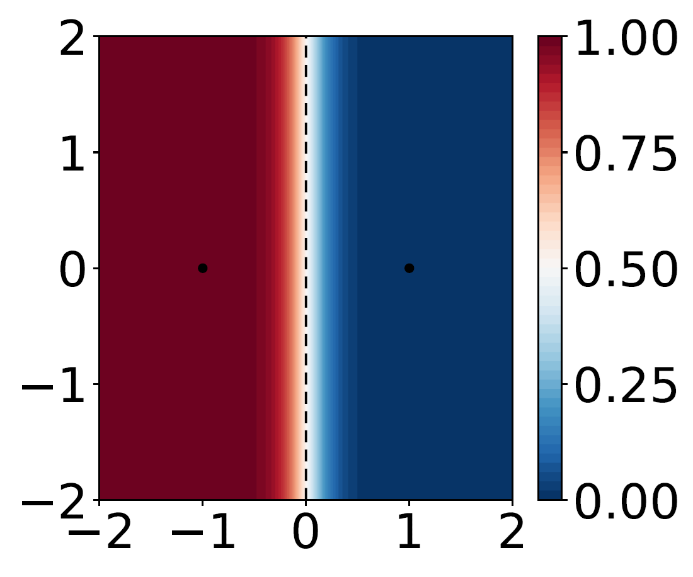
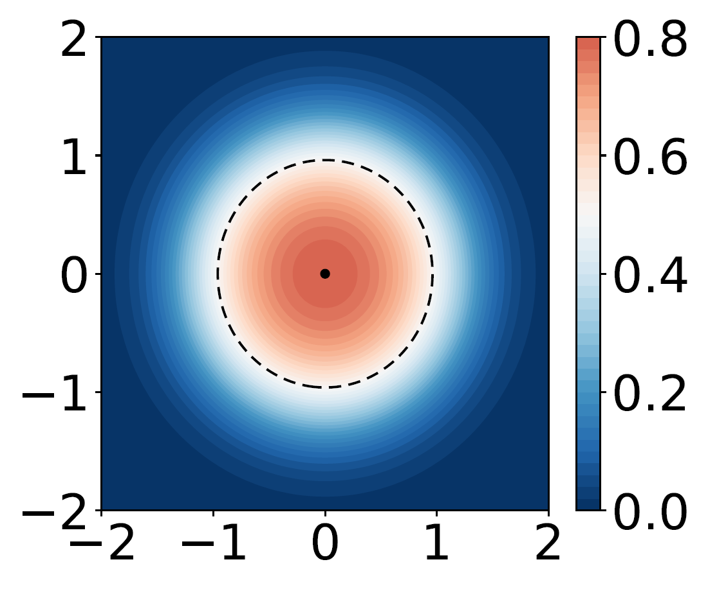
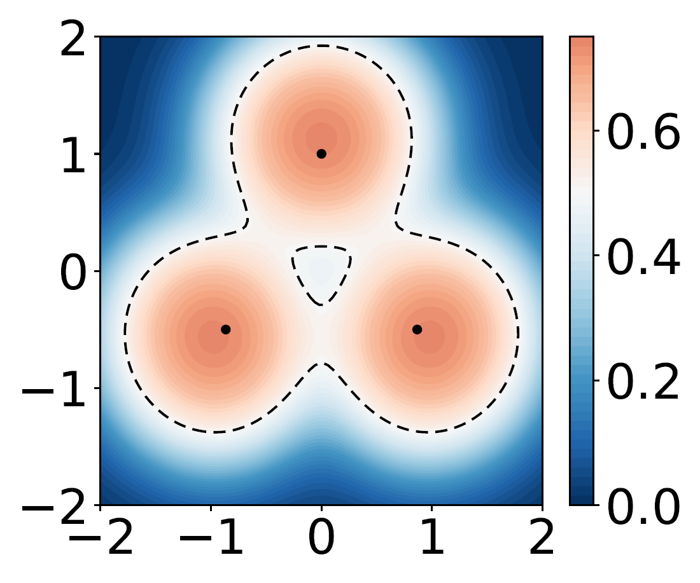
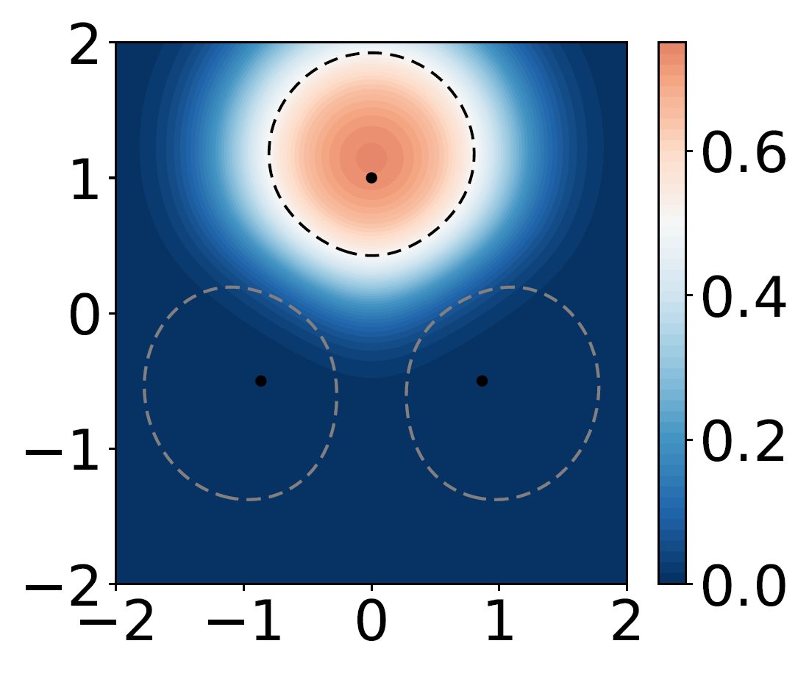

# Tied Prototype Model for Few-Shot Medical Image Segmentation

Code for our MICCAI 2025 paper "[Tied Prototype Model for Few-Shot Medical Image Segmentation](https://papers.miccai.org/miccai-2025/paper/2931_paper.pdf)" (camera-ready version)


## Table of Contents
- [Abstract](#abstract)
- [Methods](#methods)
- [Datasets](#datasets)
- [Reproducing the results](#reproducing-the-results)
- [Citation](#citation)

## Abstract
Common prototype-based medical image few-shot segmentation (FSS) methods model foreground and background classes using class-specific prototypes. However, given the high variability of the background, a more promising direction is to focus solely on foreground modeling, treating the background as an anomaly—an approach introduced by ADNet. Yet, ADNet faces three key limitations: dependence on a single prototype per class, a focus on binary classification, and fixed thresholds that fail to adapt to patient and organ variability. To address these shortcomings, we propose the Tied Prototype Model (TPM), a principled reformulation of ADNet with tied prototype locations for foreground and background distributions. Building on its probabilistic foundation, TPM naturally extends to multiple prototypes and multi-class segmentation while effectively separating non-typical background features. Notably, both extensions lead to improved segmentation accuracy. Finally, we leverage naturally occurring class priors to define an ideal target for adaptive thresholds, boosting segmentation performance. Taken together, TPM provides a fresh perspective on prototype-based FSS for medical image segmentation. The code can be found at [https://github.com/hjk92g/TPM-FSS](https://github.com/hjk92g/TPM-FSS).

## Methods
<div align="center">
  <table>
    <tr>
      <td align="center">
        <br>
        <em>(a) SPM </em>
      </td>
      <td align="center">
        <br>
        <em>(b) TPM</em>
      </td>
      <td align="center">
        <br>
        <em>(c) TPM-MP</em>
      </td>
      <td align="center">
        <br>
        <em>(d) TPM-MC</em>
      </td>
    </tr>
  </table>
</div>

(a) Standard prototype model (SPM): 
- Assigns distinct prototypes (centers) for different classes 
- Directional separation (class regions: Voronoi cells)
- Not good for modeling the highly heterogeneous background class from only a few prototypes


**(b) Tied prototype model (TPM)**: 
- Use a **tied prototype location** for foreground and background classes
- **Inside-outside (IO) classification** of feature vectors
- **Ideal for modeling the highly heterogeneous background class**
- Theorem 1: In a single prototype setting with spherical embedding, TPM is equivalent to [ADNet](https://doi.org/10.1016/j.media.2022.102385).

**(c) TPM-MP**: 
- Multi-prototype extension of TPM (multiple prototypes per class)
- Increase the representation diversity of the foreground class

**(d) TPM-MC**: 
- Multi-foreground class extension of TPM (segment multiple foreground classes simultaneously)
- Enables training to separate different foreground features into their respective prototype positions while pushing background features away from the prototypes

**Ideal class priors (ICPs)**: 
- Address class imbalance in medical image segmentation
- ICP makes: Number of predicted foreground pixel counts = Number of true foreground pixel counts
- To estimate ICPs of unseen images, we consider two estimation methods from training data: average estimation (AvgEst) and linear estimation (LinEst). LinEst uses a simple linear model that takes only 2d information: support foreground size and query slice location.

## Datasets
**ABD-MRI dataset**: [CHAOST2](https://chaos.grand-challenge.org/) 

**ABD-CT dataset**: [SABS](https://www.synapse.org/Synapse:syn3193805/wiki/) (Download Abdomen-`RawData.zip`)

## Reproducing the results

#### Requirements 
Requirements can be found in the `Dockerfile`.

#### Preprocessing
We follow the preprocessing steps described by [Ouyang et al.](https://github.com/cheng-01037/Self-supervised-Fewshot-Medical-Image-Segmentation/tree/2f2a22b74890cb9ad5e56ac234ea02b9f1c7a535?tab=readme-ov-file#2-data-pre-processing) (you can ignore their "pseudolabel generation" and following steps). For this, you need to use [their code](https://github.com/cheng-01037/Self-supervised-Fewshot-Medical-Image-Segmentation/tree/master/data).

#### Supervoxel generation
We follow the supervoxel generation step by [Hansen et al.](https://github.com/sha168/ADNet?tab=readme-ov-file#training) (you can ignore their "downloading pretrained 3D ResNeXt" and following steps). For this, you need to use [their code](https://github.com/sha168/ADNet/tree/main/supervoxels).
Specifically, run `./supervoxels/generate_supervoxels.py` with some modification. (Uncomment lines 90-91. Adjust `base_dir` and `seg_fid`, accordingly. Set `n_sv` parameter to 5000 for CHAOST2 and 2000 for SABS.)

#### Training
Before running codes, put your Weights & Biases key into `wandb.login(key='**********')` in `main_...py` files. (The same applies to analysis and inference codes.)

Run `./scripts/train_<abd, sabs>_2D.sh` for binary segmentation (single-foreground class) training. (`abd`: ABD-MRI dataset. `sabs`: ABD-CT dataset.)

Run `./scripts/train_multiclass_<abd, sabs>_2D.sh` for multi-class segmentation training.

#### Analyze
Run `./scripts/analyze_<abd, sabs>_2D.sh` to estimate (to train) ICPs for binary segmentation from training data.

Run `./scripts/analyze_multiclass_<abd, sabs>_2D.sh` to estimate (to train) ICPs for multi-class segmentation from training data.

#### Inference
(You need to run the [analyze](#analyze) step before running this step.)

Run `./scripts/test_<abd, sabs>_2D.sh` for binary segmentation evaluation.

Run `./scripts/test_multiclass_<abd, sabs>_2D.sh` for multi-class segmentation evaluation.

Note that this repo is based on [ADNet repository](https://github.com/sha168/ADNet) and our implemented ADNet++ is different from [its original paper](https://doi.org/10.1016/j.media.2023.102870). We didn't implement "3.2.2. Uncertainty estimation" and "3.2.3. Supervoxel-informed feature refinement module". 


## Citation
If you use our research, we kindly ask you to cite our paper: 
```bibtex
@inproceedings{kim2025tied,
        title = {Tied Prototype Model for Few-Shot Medical Image Segmentation},
        author = {Kim, Hyeongji and Hansen, Stine and Kampffmeyer, Michael},
        booktitle = {International Conference on Medical Image Computing and Computer-Assisted Intervention},
        year = {2025},
        publisher = {Springer},
        pages = {660 -- 670}
}
